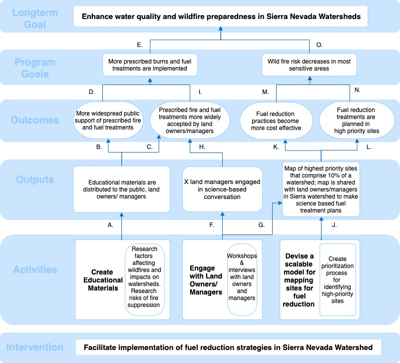

\text{\bfseries\LARGE{ESM 228 Practicum 2}}
\newline
\text{\Large{Simone Albuquerque, Sara Orofino, Elena Zhang}}
\newline
\text{\Large{May 4, 2020}}
\noindent\makebox[\linewidth]{\rule{\textwidth}{0.4pt}}


## Theory of Change  
**Organization:**  American Rivers  
**Program Title:** American Rivers Fuel Reduction Program  
**Region:** Sierra Nevada region, specificallly the following four watersheds - American River Watershed, Bear River Watershed, Cosumnes River Watershed, Yuba River Watershed    
  
   


## Measure Definition

Define the eight most important measures for the Theory of Change.  
**Measure 1: Mapping Accuracy**  

 | 
------------------------               | -------------------------------------------------------------------------------
Measure Goal             |  Assess the accuracy of the mapping of high priority sites  
 | 
Exact Measure            |  Water quality index before and after wildfires at randomly selected rivers throughout the study area  
 | 
Unit of Measurement      |  Water quality index consists of the following metrics: temperature (Celsius), turbidity (NTU), bacteria concentration (colony forming units per mL), pH, dissolved oxygen (mg/L) nutrient composition (parts per million), total suspended solids (mg/L), and toxic substances (toxic units)  
 | 
Source of Data           |  Water quality sampling at regular intervals during wildfire season
 | 
Rational for Measure     | Water quality is the primary factor defining the high priority areas, comparing water quality between randomly sampled sites designated as high priority and those not designated as high priority can help assess how much of the watershed is high priority. 
 | 
Data Collection          | American Rivers group  
 | 
Frequency of Collection  | Annual

**Measure 2: Implementation of Fuel Reduction Programs**  

 | 
------------------------               | -------------------------------------------------------------------------------
Measure Goal             |  Determine if there is a change in the number of fuel reduction programs being implemented on private lands by land owners   
 | 
Exact Measure            |  Survey question "Do you have a current Cal Fire permit for debris burning?"
 | 
Unit of Measurement      |  Individual respondents   
 | 
Source of Data           |  Independent Survey 
 | 
Rational for Measure     | Burning on private property in California requires a permit from Cal Fire, tracking the change in permits over time can give an idea of whether or not the program is increasing the demand for fire permits, which are required to implement fuel reduction programs. There are a lot of external factors (i.e. weather, air quality) that control whether or not burning can actually happen on any given day, but by applying for permits land owners show intent to participate in such programs as other factors allow.  
 | 
Data Collection          | Independent survyor, can be combined with other survey questions  
 | 
Frequency of Collection  | Annually because Cal Fire burn permits are issued annually


**Measure 3: Change in Wildfire Risk** 

 | 
------------------------               | -------------------------------------------------------------------------------
Measure Goal             |  Determine the change in frequency of high severity fires in high priority areas over 5 years   
 | 
Exact Measure            |  Number of fires and total acres burned during each annual fire season in high priority areas 
 | 
Unit of Measurement      |  Individual wildfire events 
 | 
Source of Data           |  Cal Fire wildfire statistics 
 | 
Rational for Measure     | Implementing a fuel reduction program should reduce wildfire risk. In the event of wildfires there would be less fuel for the fire to burn leading to overall lower acreages burned.  
 | 
Data Collection          | Cal Fire collects data on wildfires in California and statistics on the acreage burned per wildfire 
 | 
Frequency of Collection  | Annual

**Measure 4: Affordability of Fuel Reduction**  

  

**Measure 5: Effectiveness of Educational Materials**  

 | 
------------------------               | -------------------------------------------------------------------------------
Measure Goal             |  Assess the public perception of prescribed burns and fuel treatments over time  
 | 
Exact Measure            |  From what you have heard or read, what best describes your opinion of prescribed fires and fuel treatment actions?  Oppose, Support, Neither Oppose nor Support (i.e. neutral)  
 | 
Unit of Measurement      |  Individual survey respondents 
 | 
Source of Data           |  Independent survey firm sampling American River program participants before and after participating in American River outreach and education programs or recieving educational program materials 
 | 
Rational for Measure     | The best way to know whether the public is supportive of prescribed burns and fuel treatments is to measure it directly. The question does not lead the respondents and has balanced alternatives. The answer "oppose" is placed higher in the list as a signal that it is an appropriate answer. 
 | 
Data Collection          | Independent survey firm 
 | 
Frequency of Collection  | Prior to the educational campaigns and through the program's existence  
 

**Measure 6: Likelihood of Accepting Prescribed Burns**  

 | 
------------------------               | -------------------------------------------------------------------------------
Measure Goal             |  Determine whether landowners and managers who engage in science-based conversations are more likely to accept the importance of prescribed fuel treatments.     
 | 
Exact Measure            |  What is your opinion on the following statement: "Prescribed fire and fuel treatments can lower the risk of wildfire."  Strongly disagreee, Disagree, Neutral, Agree, Strongly Agree  
 | 
Unit of Measurement      |  Individual survey respondent  
 | 
Source of Data           |  Survey responses from educational meeting attendees in different counties.  
 | 
Rational for Measure     | The best way to determine the extent to which land managers accept the importance of prescribed fuel treatments is to use a Likert scale question. The response scale starts with "Strongly disagree" and ends with "Strongly Agree", in order to avoid response order bias. A neutral response is added in the middle so respondents aren't forced to choose a side.  
 | 
Data Collection          | American Rivers
 | 
Frequency of Collection  | Before and after each educational meeting held as part of the program implementation  
   

**Measure 7: Impact of Public Support**  

 | 
------------------------               | -------------------------------------------------------------------------------
Measure Goal             |  Determine if public support increases the number of prescribed burns in the Sierra Nevada region   
 | 
Exact Measure            |  Satellite data (Modis Terra) imagery of extent of land burned vs. not burned in high priority regions of the study area   
 | 
Unit of Measurement      |  Acres of study area  
 | 
Source of Data           |  Nasa
 | 
Rational for Measure     | A relatively cost effective means of monitoring large areas for fire and comparing across years 
 | 
Data Collection          | NASA collects the Modis Terra satellite data and makes it publically available on their website  
 | 
Frequency of Collection  | Readings are taken twice per day, data is analyzed annually during the prescribed burning season 
  
  
**Measure 8: Effect on Water Quality**  

 | 
------------------------               | -------------------------------------------------------------------------------
Measure Goal             |  Determine how water quality changes in the high priority regions of the study area when fuel treatments are used vs. when they are not used. 
 | 
Exact Measure            |  Sediment yield (total dissolved solids) in reservoir intake areas within 50 miles of a high priority burn site  
 | 
Unit of Measurement      |  Parts per million 
 | 
Source of Data           |  Reservoir data
 | 
Rational for Measure     | Reservoirs will already be measuring the water quality in close proximity to infiltration points, which we will target in high priority areas. This is a cost effective way of getting real time water quality data throughout the year, which otherwise may be costly.  
 | 
Data Collection          | Local county water utilities 
 | 
Frequency of Collection  | Daily, focused on measures during fire season 
 
  
## Sampling Strategy

**Measure 2 - Implementation of Fuels Reduction Programs** 

*Target population*: Private land owners/managers in the study area

*Challenges to representative sampling*: Much of the land in the Sierra Nevada watershed is federally owned not privately owned, but federal actions involve more factors than simply perception and willingness to pay. Private land owners require permits to implement fuel reduction programs but fuel reduction typically doesn't occur every year and it is unclear if the same land owner would continue to apply for permits in years immediately following implementing a fuel reduction program on their land.  

*Sampling procedure* Random sampling of private land owners in the study area to determine if they are Cal Fire permit holders, stratified by county since some counties account for a higher proportion of land in the study area. 


### DeclareDesign()

Declare the population  
```{r measure1-population, message=FALSE, warning=FALSE}
# baseline = proportion of land area each county contributes to the total study area
# prop = proportion of homeowners in each strata out of the total population (workaround for strata mean function error - see 'measure1-delcare-estimator' code below)
# owner = 35% of the number of homeowners in the county, since all homeowners may not have large properties where they are participating in fuel management practices


population <- declare_population(
  county = add_level(N=8, # there are 8 counties in the watershed
                     baseline=c(0.36,0.23,0.18,0.5,0.5,0.5,0.5, 0.3), # % coverage of each county in study area
                     prop=c(0.459298084, 0.243157809, 0.141842055, 0.067543836, 
                            0.054035069, 0.028368411, 0.004552455, 0.001202280)), #proportion of homeowners in each county
  owner = add_level(N=c(34000,18000, 10500, 5000, 4000, 2100, 337, 89), # 35% of each county's homeowner population
                    know=draw_binary(baseline))
)

pop <- population()
pop.vector <- c(34000,18000, 10500, 5000, 4000, 2100, 337, 89)

my_estimand <- declare_estimands(mean(know),
                                 label = "Ybar")
```

Reporting and Sampling  
```{r measure1-report-samp, message=FALSE, warning=FALSE}
reporting <- declare_assignment(prob=0.4, #lower probably that any given homeowner would be a burn permit holder
                  assignment_variable = "R")

sampling <- declare_sampling(strata=county,
               strata_n=c(80,80,80,80,80,80,10,10)) # sample size 500
```


Declare estimator to calculate the strata weighed mean of the sample to estimate the population    
```{r measure1-declare-estimator, message=FALSE, warning=FALSE}
# function to estimate the population mean using the strata weighted sample mean  
strata_weighted_mean <- function(data){
  data.frame(  
    estimator_label = "strata_w_mean",
    estimand_label = "Ybar",
    n = nrow(data),
    stringsAsFactors = FALSE,
    
    estimate = data %>% filter(R==1) %>%
      group_by(as.factor(county)) %>% # strata by county
      summarise(mean=mean(know), prop=mean(prop)) %>% #work around for prop column error - see below
      # mutate(prop=pop.vector/sum(pop.vector)) %>% 
      mutate(sub.mean=mean*prop) %>% pull(sub.mean) %>% 
      sum()) 
} 
# note: prop column kept throwning me a length error (wanted length 7 not 8), I changed all the other vectors to be length 8 and couldn't figure out why it was requiring a length 7 when the strata and my pop.vector was set to 8. Patrick helped me with a workaround - the prop=mean(prop) gives the proportion of households in the strata based on the prop column we defined in the population setup code.  
```

Measure 1 diagnostics
```{r measure1-diagnosis, message=FALSE, warning=FALSE}

answer <- declare_estimator(
  handler = tidy_estimator(strata_weighted_mean), 
  estimand = my_estimand) 

design <- population + my_estimand + reporting +
          sampling + answer

diagnosis <- diagnose_design(design, sims = 1000)

diagnosis$diagnosands_df[,c(4,5,12,14)] %>%
  kable()

```


**Measure 5 - Effectiveness of Educational Materials** 

*Target Population*: Private land owners in the studied area

*Challenge of drawing a representative sample*: Sampling efforts are done by mailing questionnaires to randomly selected home owners in the 8 counties in the CABY region, but these clusters are of unequal size. It is unclear how many of the questionnaire recipients actually respond to the questionnaire. 

*Sampling procedure*: Random sampling of private land owners in the 8 counties in the CABY region with unequal effort according to potential sample size (since some counties have larger population than others)

Using demogrpahic data of each county, we found the approximate number of private land owners per county in the CABY region.

County              Approximate private landowner population per county
-----------         ---------------------------------------------------
El Dorado           90000
Placer              50000
Nevada              30000
Sierra              14000
Yuba                11000
Plumas              6000
Amador              900
Alpine              250

### DeclareDesign()

Declare the population

```{r pop}
set.seed(228)
population <- declare_population(
  county = add_level(N=8, 
           basemean=c(1,0.5,0.5,0,-0.4,-0.2,-1,-1)), # the 'basemean' variable represents the mean value of the normal random variable that we use to generate the scale of the survey answers (support, oppose, neither oppose nor support), we assume that land owners in smaller counties tend to oppose prescribed burns and fuel treatments.
  
  homeowner = add_level(N=c(90000,50000,30000,14000,11000,6000,900,250),
                      support=draw_ordered(x = rnorm (n = N, mean = basemean),
                      breaks = c (-1, 1),
                      #break_labels = c("support","neutral","oppose")
                      )) #Here homeowners are labeled by support (value=3), neutral (value=2), or oppose (value=1), corresponding to the value of the normal random variable x<-1, -1<x<1, 1<x
)
pop <- population()
pop.vector <- c(90000,50000,30000,14000,11000,6000,900,250)

my_estimand <- declare_estimands(mean(support),
                                 label = "Ybar")


```

Reporting and Sampling

```{r report-samp}
reporting <- declare_assignment(prob=0.4,
                  assignment_variable = "R")
# we assume a 40% survey response rate.

sampling <- declare_sampling(strata=county,
               strata_n=c(500,200,100,70,70,30,15,15))
# we are sampling by county, our strata. We're going to send out 1000 questionnaires in total: 500 questionnaires in El Dorado, 200 in Placer, 100 in Nevada, 70 in Sierra, 70 in Yuba, 30 in Plumas, 15 in Amador, and 15 in Alpine.
```

Declare estimator

```{r declare-estimator}

strata_weighted_mean <- function(data){
  data.frame(  
  estimator_label = "strata_w_mean",
  estimand_label = "Ybar",
  n = nrow(data),
  stringsAsFactors = FALSE,
  
  estimate = data %>% filter(R==1) %>% 
    group_by(county) %>% 
    summarise(mean=mean(support)) %>%
    mutate(prop=pop.vector/sum(pop.vector)) %>% 
    mutate(sub.mean=mean*prop) %>% pull(sub.mean) %>%  
    sum()) 
}

```

Measure 5 Diagnostic

```{r diagnosis, cache=TRUE}

answer <- declare_estimator(
  handler = tidy_estimator(strata_weighted_mean), 
  estimand = my_estimand) 

design <- population + my_estimand + reporting + sampling + answer
diagnosis <- diagnose_design(design, sims = 1000)

diagnosis$diagnosands_df[,c(4,5,12,14)] %>%
  kable()

```
